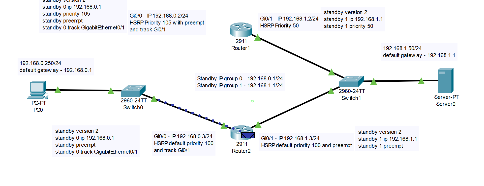
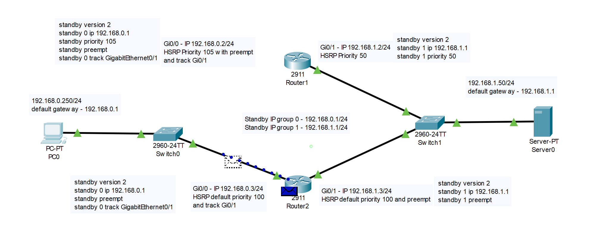

# sflt-homeworks

# Домашнее задание к занятию 1 «Disaster recovery и Keepalived»


### Задание 1
- Дана [схема](1/hsrp_advanced.pkt) для Cisco Packet Tracer, рассматриваемая в лекции.
- На данной схеме уже настроено отслеживание интерфейсов маршрутизаторов Gi0/1 (для нулевой группы)
- Необходимо аналогично настроить отслеживание состояния интерфейсов Gi0/0 (для первой группы).
- Для проверки корректности настройки, разорвите один из кабелей между одним из маршрутизаторов и Switch0 и запустите ping между PC0 и Server0.
- На проверку отправьте получившуюся схему в формате pkt и скриншот, где виден процесс настройки маршрутизатора.

### Ответ на задание 1
1. Включаем отслеживания состояния интерфейса в протоколе HSRP на обоих узлах Router1 и Router2
```txt
enable 
configure terminal
interface GigabitEthernet0/0
standby 1 track GigabitEthernet0/0
exit
```
------




### Задание 2
- Запустите две виртуальные машины Linux, установите и настройте сервис Keepalived как в лекции, используя пример конфигурационного [файла](1/keepalived-simple.conf).
- Настройте любой веб-сервер (например, nginx или simple python server) на двух виртуальных машинах
- Напишите Bash-скрипт, который будет проверять доступность порта данного веб-сервера и существование файла index.html в root-директории данного веб-сервера.
- Настройте Keepalived так, чтобы он запускал данный скрипт каждые 3 секунды и переносил виртуальный IP на другой сервер, если bash-скрипт завершался с кодом, отличным от нуля (то есть порт веб-сервера был недоступен или отсутствовал index.html). Используйте для этого секцию vrrp_script
- На проверку отправьте получившейся bash-скрипт и конфигурационный файл keepalived, а также скриншот с демонстрацией переезда плавающего ip на другой сервер в случае недоступности порта или файла index.html

### Ответ на задание 2
Bash-скрипт (check_web.sh)
```
#!/bin/bash
PORT=80
URL="http://localhost"
INDEX_FILE="/var/www/html/index.html"
# Проверка порта
if ! nc -z localhost $PORT; then
    echo "Port $PORT is not open"
    exit 1
fi
# Проверка index.html
if [ ! -f "$INDEX_FILE" ]; then
    echo "index.html not found"
    exit 2
fi
exit 0
```
Конфигурационные файлы Keepalived MASTER/BACKUP
```
vrrp_script chk_web {
    script "/etc/keepalived/check_web.sh"
    interval 3
    fall 2
    rise 1
}

vrrp_instance VI_1 {
    state MASTER #Для2 -> BACKUP
    interface eth0
    virtual_router_id 15
    priority 150 Для2 -> 100
    advert_int 1

    authentication {
        auth_type PASS
        auth_pass 1234
    }

    virtual_ipaddress {
        10.0.0.100/24
    }

    track_script {
        chk_web
    }
}
```
